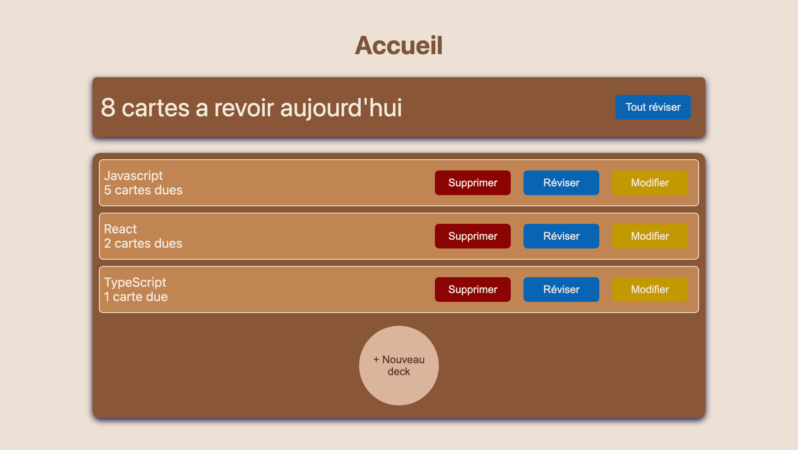
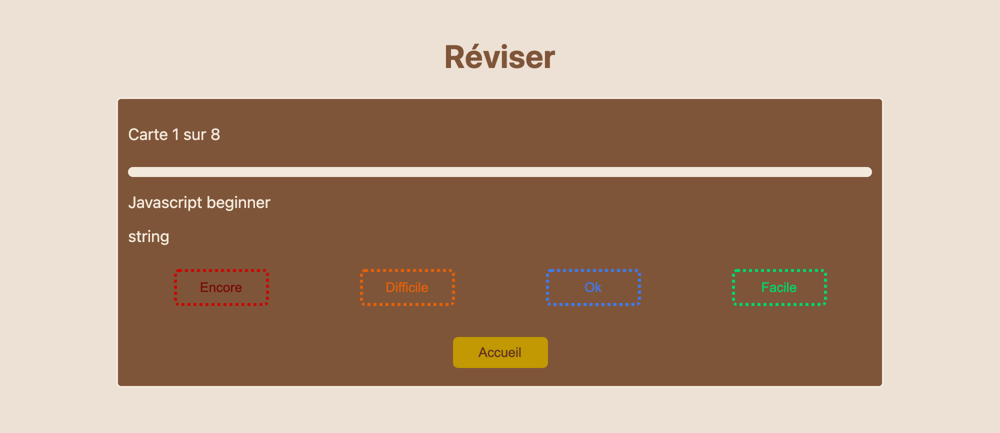

# Recall

Spaced-repetition flashcards. Rate a card, and it comes back exactly when
you are about to forget it.

**[Live demo](https://recall-flashcards.vercel.app)** — no account, no
server, nothing to install.



## Why

Reviewing a card every day wastes time on what you already know. Reviewing
it once and never again teaches you nothing. Recall schedules every card
with the **SM-2 algorithm**: grade it from *again* to *easy*, and it
returns after a day, then six, then weeks — the interval stretching as the
card gets easier and collapsing the moment you fail it.

Create decks, write cards, review what is due. Everything stays in your
browser.



## Design decisions

**The scheduling is a pure function.** `schedule(card, grade, today)` takes
a card and returns a new one: no clock, no storage, no side effect. `today`
is passed in rather than read from `new Date()`, which is what makes the
algorithm testable — the same inputs always produce the same output. It was
written test-first, before any interface existed.

**All state changes go through one reducer.** Actions are a discriminated
union, so `add_card` and `edit_card` cannot be confused, and the `default`
branch narrows to `never` — adding an action without handling it is a
compile error, not a runtime surprise.

**Actions carry the smallest thing that works.** `add_card` carries a whole
`Card`, `delete_card` carries only an id, and `edit_card` carries the two
text fields and nothing else. That last one is deliberate: had it carried a
whole card, the component would have to copy the SM-2 history by hand, and
one forgotten field would silently reset a card's progress while still
type-checking. The shape of the action makes the mistake impossible to
write.

**No backend, on purpose.** Everything lives in `localStorage`. Nothing to
deploy, nothing to pay for, no personal data collected, and the app works
offline. The trade-off is real and accepted: your cards do not follow you
to another device.

**Stored data is versioned.** `load()` compares the stored schema version
against the current one and, when they differ, copies the raw text under a
backup key before refusing it. Refusing without archiving would have
destroyed data — the app saves right after the first render, so returning
nothing would overwrite what was there.

## A note on language

The interface is in French, the codebase is not. Recall is a tool I built
for myself and I revise in French, so that is the language on screen.
Identifiers, commit messages and this README are in English, because that
is the working language of the trade. Two audiences, two languages.

## Two bugs worth mentioning

They are here because finding them taught me more than the features did.

**The review screen skipped every other card.** The cursor was owned state
counting up by one, while the list it indexed was derived and shrank by one
every time a card was graded. Eighteen tests were green: they covered each
brick, never the assembly. The fix was two lines — take a snapshot of the
list when the screen mounts, and index that.

**Deleting a deck orphaned its cards.** They stayed in storage forever,
invisible to every screen but still counted in the home total. Found by
reading the code, not by using the app. The existing test started from an
empty card list — it exercised the right function but had nothing to
forget. A test needs a witness: something that must survive.

## Stack

React 19, TypeScript in `strict` mode, Vite, Vitest. Plain CSS, no
framework. 21 tests covering the scheduler, the due-card filter, the
reducer and the storage layer.

## Running it locally

```bash
npm install
npm run dev      # http://localhost:5173
npm test         # watch mode
npm run build    # tsc -b && vite build
```

## What it does not do yet

No sync between devices, no mobile layout, no import or export. The card
list is built for a desktop screen.
